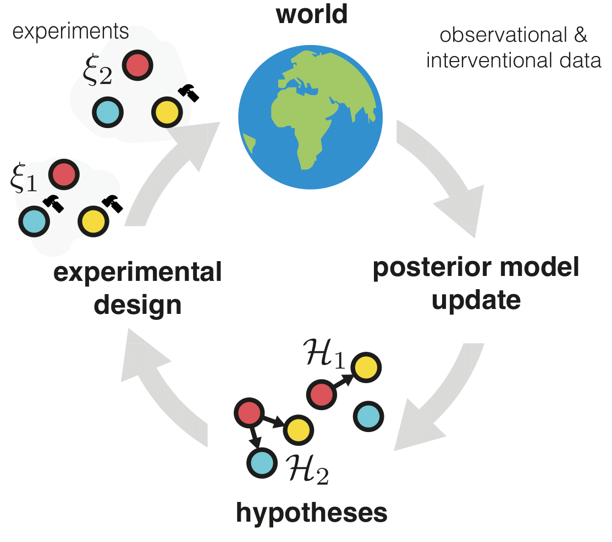

[](https://arxiv.org/abs/2302.10607) 


# Differentiable Multi-Target Causal Bayesian Experimental Design (DiffCBED)

## Overview 

This is the official repository with the python implementation for the paper "[Differentiable Multi-Target Causal Bayesian Experimental Design](https://arxiv.org/abs/2302.10607)", ICML (2023). 

The repository contains different acquisition strategies for optimal targeted interventions to learn causal models, including the proposed approach _DiffCBED_ (which acquires both intervention batch of (multi-)target and values).

<p align="center">

</p>

## Installation

In order to run this repository on your machine, it is recommended to follow the below steps.

1. Clone the repository
```bash
git clone --recurse-submodules https://github.com/yannadani/DiffCBED.git
cd diffcbed
```
2. Install the relevant packages in an environment, through Anaconda. Anaconda is preferable as R packages can be installed easily without much effort. To do so, please do the following:
```bash
conda env create -f environment.yml
conda activate diffcbed
```

3. Install the requirements by running the following commands:
```bash
pip install -r requirements.txt
Rscript models/dag_bootstrap_lib/install.r
```

## Usage

- In order to run the DiffCBED policy (multi-target state) for 20 nodes with batch size of 2, run the following command:
```bash
python experimental_design.py --data_seed <data_seed> --model dag_bootstrap --num_nodes 20 --batch_size 2 --num_starting_samples 60 --strategy policyoptnmc --group_interventions --num_samples 25 --exp_edges .5 --num_targets -1 --old_er_logic 
```
For constrained multi-target, replace `--num_targets` flag with the desired number of targets (< d).

- For running other acquisition strategies like SSGb, run:
```bash
python experimental_design.py --data_seed <data_seed> --model dag_bootstrap --num_nodes 20 --batch_size 2 --num_starting_samples 60 --strategy ss_finite --group_interventions --num_samples 25 --exp_edges .5 --num_targets -1 --old_er_logic --intervention_value 5
```

- For running random strategy, run:
```bash
python experimental_design.py --data_seed <data_seed> --model dag_bootstrap --num_nodes 20 --batch_size 2 --num_starting_samples 60 --strategy random  --group_interventions --num_samples 25 --exp_edges .5 --num_targets -1 --old_er_logic --value_strategy random
```

Other parameters can be changed to desired values (for e.g. different number of variables with the flag `--num_nodes`). `python experimental_design.py --help` gives more details.

## Reproducing the results 
- Details for reproducing the results in the paper are given in the branch full.

## Reference
This code is official implementation of the following paper:
> Yashas Annadani, Panagiotis Tigas, Desi R. Ivanova, Andrew Jesson, Yarin Gal, Adam Foster, Stefan Bauer. **Differentiable Multi-Target Causal Bayesian Experimental Design**. In International Conference on Machine Learning (ICML), 2022. [PDF](https://arxiv.org/pdf/2302.10607.pdf)
